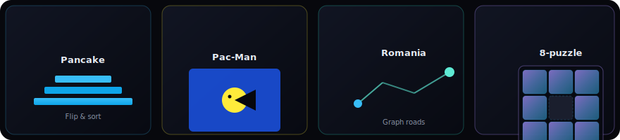
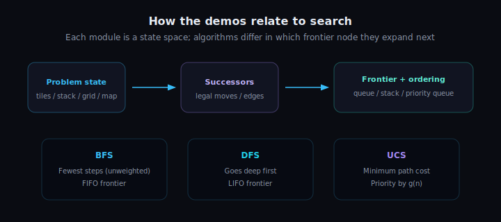

<div align="center">

# CS170 · Introduction to Artificial Intelligence

**Interactive visual demos for classical search**

[](https://www.cs.ucr.edu/)
[](./)
[](./netlify.toml)

<br />


<br />

*A browser-based companion for **CS170** at **UC Riverside**: explore **BFS**, **DFS**, and **uniform-cost search (UCS)** on familiar textbook problems — with step-by-step visualization, not just pseudocode on a slide.*

</div>

---

## What this site is

This repository holds a **static, self-contained website** (HTML + CSS + JavaScript) that presents **four classic AI search domains** as **interactive labs**. Each page lets you pick an algorithm, run or step through search, and watch how the **frontier** and **visited states** evolve. The visual language is consistent across modules: **dark UI**, **cyan accents**, and **readable typography** (Outfit + JetBrains Mono), tuned for long study sessions.

The **landing page** introduces all modules and links to each demo. Every sub-page is a standalone “mini app” with controls tailored to that problem (randomize, play mode, city pickers, etc.).

<p align="center">
  
</p>

---

## The four demos

| Module | Idea | What you do |
|--------|------|-------------|
| [**Pancake**](pancake/) | Sort a stack by **reversing the top k** pancakes | Compare flips under BFS vs DFS vs cost-weighted UCS |
| [**Pac-Man**](pacman/) | **Eat all dots** in a maze (no ghosts) | Search in a grid; state includes **position + remaining dots** |
| [**Romania**](romania/) | **Road network** from the AI textbook | Pick **start / goal** cities; trace paths on the map (e.g. Arad → Bucharest) |
| [**8-puzzle**](eight-puzzle/) | **3×3 sliding tiles** | Run search, **randomize**, or **play manually** with a move limit tied to optimal length |

Together, these cover **discrete state spaces** of different shapes: permutations, grid-with-subset, graph, and tile puzzles.

---

## How search is presented

Every demo implements the same conceptual pipeline: **current state → legal moves → frontier ordered by the algorithm**. The diagram below summarizes how **BFS**, **DFS**, and **UCS** differ (mainly **which node is expanded next**).

<p align="center">
  
</p>

- **BFS** — expands shallow nodes first (**shortest path** in **unweighted** step counts).  
- **DFS** — goes **deep** before wide (**LIFO** frontier; not guaranteed optimal).  
- **UCS** — always expands the **lowest path cost g(n)** so far (**priority queue**; optimal when step costs are non-negative).

---

## Tech & deployment

| Aspect | Detail |
|--------|--------|
| **Stack** | Static files only — no build step |
| **Hosting** | [Netlify](https://www.netlify.com/) ready via [`netlify.toml`](netlify.toml) (`publish = "."`) |
| **Security headers** | `X-Frame-Options`, `X-Content-Type-Options`, `Referrer-Policy` (see config) |

**Local preview:** serve the folder with any static server, for example:

```bash
# Python 3
python -m http.server 8080
```

Then open `http://localhost:8080/` (use clean URLs like `/pancake/` if your server supports it).

**GitHub Pages:** enable Pages from the `main` branch, site root — or deploy the same folder to Netlify by connecting this repo.

---

## Credits

Course material for **CS170 — Introduction to Artificial Intelligence**, **University of California, Riverside**.

© 2026 Pratyay Dutta, Department of Computer Science, UC Riverside.

---

<div align="center">

<sub>If this README’s diagrams look familiar, they intentionally echo the on-site aesthetic — deep background, cool highlights, and a nod to “search trees” as first-class objects.</sub>

</div>
